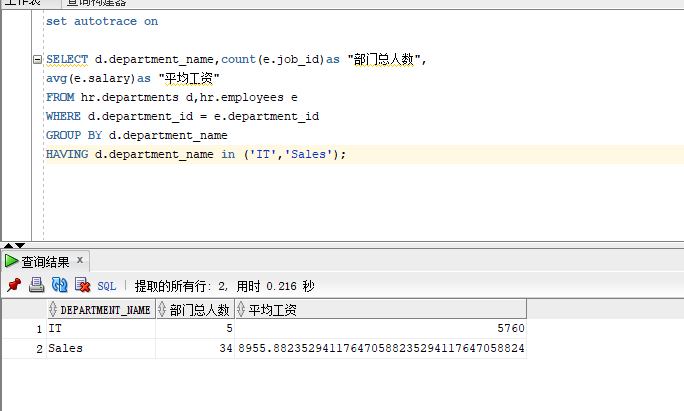
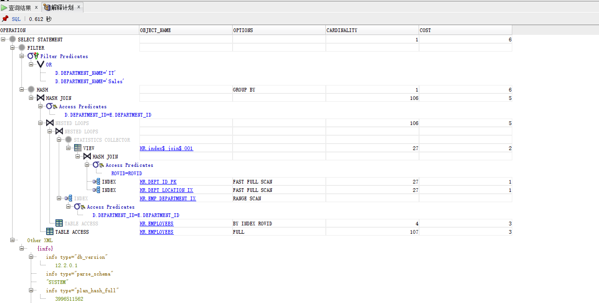

# 我的作业1

**姓名：杨永涛**

**学号:201810414127**

## 实验目的

分析SQL执行计划，执行SQL语句的优化指导。理解分析SQL语句的执行计划的重要作用。

## 实验内容

- 对Oracle12c中的HR人力资源管理系统中的表进行查询与分析。

- 首先运行和分析教材中的样例：本训练任务目的是查询两个部门('IT'和'Sales')的部门总人数和平均工资，以下两个查询的结果是一样的。但效率不相同。
- 设计自己的查询语句，并作相应的分析，查询语句不能太简单。

## 1.比较两个查询语句

**查询1：**

```sql
set autotrace on

SELECT d.department_name,count(e.job_id)as "部门总人数",
avg(e.salary)as "平均工资"
from hr.departments d,hr.employees e
where d.department_id = e.department_id
and d.department_name in ('IT','Sales')
GROUP BY d.department_name;
```

**执行结果：**


**执行计划**


**查询2：**

```sql
set autotrace on

SELECT d.department_name,count(e.job_id)as "部门总人数",
avg(e.salary)as "平均工资"
FROM hr.departments d,hr.employees e
WHERE d.department_id = e.department_id
GROUP BY d.department_name
HAVING d.department_name in ('IT','Sales');
```

**执行结果**


**执行计划**


## 总结：总的来说，查询1要优于查询2，因为查询1中的参数基本上都优于查询2，可以看出查询1是先过滤后汇总，参与汇总的数据量少，查询2是先汇总再过滤，参与汇总的数据量要多一些。

**对第一条sql语句进行优化指导**


**设计查询语句**

```sql
SELECT a.JOB_TITLE,a.MAX_SALARY, d.DEPARTMENT_NAME
from hr.JOBS a,hr.JOB_HISTORY b,hr.DEPARTMENTS d
where a.JOB_ID=b.JOB_ID and b.DEPARTMENT_ID=d.DEPARTMENT_ID
and d.DEPARTMENT_NAME in ('IT','Sales')
```

查询属于IT部门和销售部门中，各个职位的名称以及他们对应的最大最小工资。

**执行结果**


**执行计划**


**优化指导**


## 实验参考地址

- Oracle地址：202.115.82.8 用户名：system ， 密码123， 数据库名称：pdborcl，端口号：1521
- 用户hr默认没有统计权限，运行上述命令时要报错：

```
无法收集统计信息, 请确保用户具有正确的访问权限。
统计信息功能要求向用户授予 v_$sesstat, v_$statname 和 v_$session 的选择权限。
```

怎样解决？

**普通用户不允许查询执行计划，必须有Plustrace角色才可以。Oracle的插接式数据库本身并没有默认创建plustrace角色，需要首先再pdborcl数据库中创建角色plustrace，用sys登录到PDB数据库，然后运行$ORACLE_HOME/sqlplus/admin/plustrce.sql脚本文件，最后通过"GRANT plustrace to 用户名" 命令将plustrace赋予用户。**
