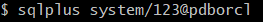

# 我的作业2

**姓名：杨永涛**

**学号:201810414127**

## 实验目的

掌握用户管理、角色管理、权根维护与分配的能力，掌握用户之间共享对象的操作技能。

## 实验内容

在pdborcl插接式数据中创建一个新的本地角色con_res_view，该角色包含connect和resource角色，同时也包含CREATE VIEW权限，这样任何拥有con_res_view的用户就同时拥有这三种权限。

创建角色之后，再创建用户new_user，给用户分配表空间，设置限额为50M，授予con_res_view角色。

最后测试：用新用户new_user连接数据库、创建表，插入数据，创建视图，查询表和视图的数据。

**用system登录到数据库**

**创建角色，已经存在该角色则创建新角色con_res_view1**

**对角色赋权**

**创建用户(用户已经存在则创建yyt用户)**

**对用户分配空间和赋权**

**新用户yyt连接到pdborcl**

**创建表mytable和视图myview，插入数据，最后将myview的SELECT对象权限授予hr用户。**

**用户hr连接到pdborcl**

**查询new_user授予它的视图myview**

查看表空间的数据库文件，以及每个文件的磁盘占用情况。

autoextensible是显示表空间中的数据文件是否自动增加。
MAX_MB是指数据文件的最大容量。

**在sqldeveloper运行**

**在sqldeveloper运行**

