# 我的作业4

**姓名：杨永涛**

**学号:201810414127**

## 实验目的

了解Oracle表和视图的概念，学习使用SQL语句Create Table创建表，学习Select语句插入，修改，删除以及查询数据，学习使用SQL语句创建视图，学习部分存储过程和触发器的使用。

数据库：yytdb 用户名：yyt

## 实验场景

假设有一个生产某个产品的单位，单位接受网上订单进行产品的销售。通过实验模拟这个单位的部分信息：员工表，部门表，订单表，订单详单表。

## 实验内容

#### 录入数据

要求至少有1万个订单，每个订单至少有4个详单。至少有两个部门，每个部门至少有1个员工，其中只有一个人没有领导，一个领导至少有一个下属，并且它的下属是另一个人的领导（比如A领导B，B领导C）。

#### 序列的应用

插入ORDERS和ORDER_DETAILS 两个表的数据时，主键ORDERS.ORDER_ID, ORDER_DETAILS.ID的值必须通过序列SEQ_ORDER_ID和SEQ_ORDER_ID取得，不能手工输入一个数字。

#### 触发器的应用：

维护ORDER_DETAILS的数据时（insert,delete,update）要同步更新ORDERS表订单应收货款ORDERS.Trade_Receivable的值。

## 分区策略设计

根据订单日期进行范围分区。不同的年份的数据存储在不同的分区中，将2016年以前的数据存入users中，将2016年到2017年的数据存入USERS02中，将2017到2018的数据添加到一个动态的分区种。

## 实验步骤

## 1.在自己的数据库(yytdb)下的用户(yyt)手工增加表空间并且完成表空间的配额和对用户的角色权限和系统权限的赋予

```sql
Create Tablespace Users02
datafile
'/home/student/pdb/yytdb/pdbtest_users02_1.dbf'
  SIZE 100M AUTOEXTEND ON NEXT 256M MAXSIZE UNLIMITED,
'/home/student/pdb/yytdb/pdbtest_users02_2.dbf'
  SIZE 100M AUTOEXTEND ON NEXT 256M MAXSIZE UNLIMITED
EXTENT MANAGEMENT LOCAL SEGMENT SPACE MANAGEMENT AUTO;
-- QUOTAS
ALTER USER yyt QUOTA UNLIMITED ON USERS;
ALTER USER yyt QUOTA UNLIMITED ON USERS02;
ALTER USER yyt ACCOUNT UNLOCK;
-- ROLES
GRANT "CONNECT" TO yyt WITH ADMIN OPTION;
GRANT "RESOURCE" TO yyt WITH ADMIN OPTION;
ALTER USER yyt DEFAULT ROLE "CONNECT","RESOURCE";

-- SYSTEM PRIVILEGES
GRANT CREATE VIEW TO yyt WITH ADMIN OPTION;
```

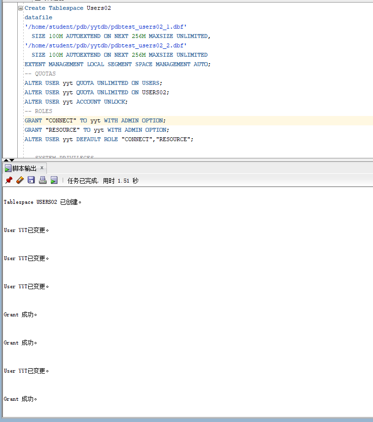

## 2.创建表DEPARTMENTS

```sql
CREATE TABLE DEPARTMENTS
(
  DEPARTMENT_ID NUMBER(6, 0) NOT NULL
, DEPARTMENT_NAME VARCHAR2(40 BYTE) NOT NULL
, CONSTRAINT DEPARTMENTS_PK PRIMARY KEY
  (
    DEPARTMENT_ID
  )
  USING INDEX
  (
      CREATE UNIQUE INDEX DEPARTMENTS_PK ON DEPARTMENTS (DEPARTMENT_ID ASC)
      NOLOGGING
      TABLESPACE USERS
      PCTFREE 10
      INITRANS 2
   STORAGE
      (
        INITIAL 65536
        NEXT 1048576
        MINEXTENTS 1
        MAXEXTENTS UNLIMITED
        BUFFER_POOL DEFAULT
      )
      NOPARALLEL
  )
 ......
```

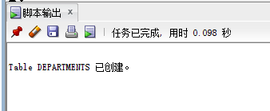
## 3.创建表employee

```sql
CREATE TABLE EMPLOYEES
(
  EMPLOYEE_ID NUMBER(6, 0) NOT NULL
, NAME VARCHAR2(40 BYTE) NOT NULL
, EMAIL VARCHAR2(40 BYTE)
, PHONE_NUMBER VARCHAR2(40 BYTE)
, HIRE_DATE DATE NOT NULL
, SALARY NUMBER(8, 2)
, MANAGER_ID NUMBER(6, 0)
, DEPARTMENT_ID NUMBER(6, 0)
, PHOTO BLOB
, CONSTRAINT EMPLOYEES_PK PRIMARY KEY
  (
    EMPLOYEE_ID
  )
  ......
```

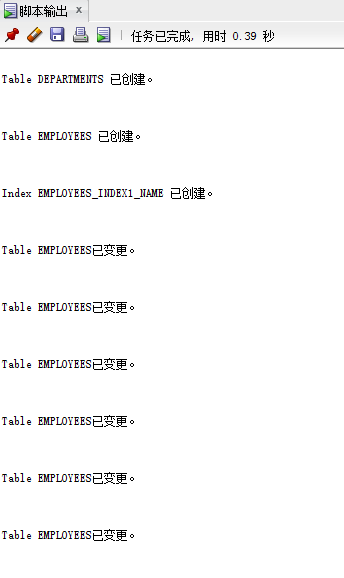

## 4.创建表PRODUCTS

```sql
CREATE TABLE PRODUCTS
(
  PRODUCT_NAME VARCHAR2(40 BYTE) NOT NULL
, PRODUCT_TYPE VARCHAR2(40 BYTE) NOT NULL
, CONSTRAINT PRODUCTS_PK PRIMARY KEY
  (
    PRODUCT_NAME
  )
  ENABLE
)
LOGGING
TABLESPACE "USERS"
PCTFREE 10
INITRANS 1
STORAGE
(
  INITIAL 65536
  NEXT 1048576
  MINEXTENTS 1
  MAXEXTENTS 2147483645
  BUFFER_POOL DEFAULT
);
......
```

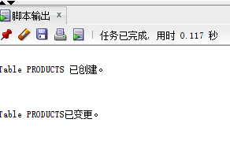

5.创建ORDERS表

```sql
CREATE TABLE ORDERS
(
  ORDER_ID NUMBER(10, 0) NOT NULL
, CUSTOMER_NAME VARCHAR2(40 BYTE) NOT NULL
, CUSTOMER_TEL VARCHAR2(40 BYTE) NOT NULL
, ORDER_DATE DATE NOT NULL
, EMPLOYEE_ID NUMBER(6, 0) NOT NULL
, DISCOUNT NUMBER(8, 2) DEFAULT 0
, TRADE_RECEIVABLE NUMBER(8, 2) DEFAULT 0
)
TABLESPACE USERS
PCTFREE 10
INITRANS 1
STORAGE
(
  BUFFER_POOL DEFAULT
)
......
```

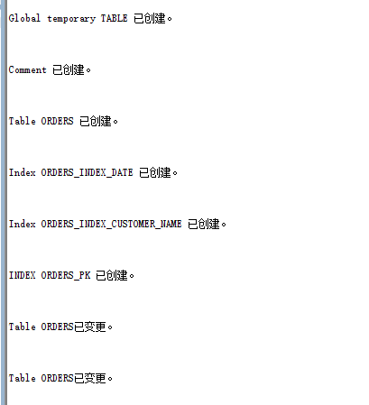

6.创建ORDERS_DETAILS表

```sql
CREATE TABLE ORDER_DETAILS
(
  ID NUMBER(10, 0) NOT NULL
, ORDER_ID NUMBER(10, 0) NOT NULL
, PRODUCT_NAME VARCHAR2(40 BYTE) NOT NULL
, PRODUCT_NUM NUMBER(8, 2) NOT NULL
, PRODUCT_PRICE NUMBER(8, 2) NOT NULL
, CONSTRAINT ORDER_DETAILS_FK1 FOREIGN KEY
  (
  ORDER_ID
  )
  REFERENCES ORDERS
  (
  ORDER_ID
  )
  ENABLE
)
TABLESPACE USERS
PCTFREE 10
INITRANS 1
STORAGE
......
```

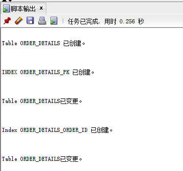

7.创建三个触发器并且在批量插入订单数据之前，禁用触发器

```sql
CREATE OR REPLACE EDITIONABLE TRIGGER "ORDERS_TRIG_ROW_LEVEL"
BEFORE INSERT OR UPDATE OF DISCOUNT ON "ORDERS"
FOR EACH ROW --行级触发器
declare
  m number(8,2);
BEGIN
  if inserting then
       :new.TRADE_RECEIVABLE := - :new.discount;
  else
      select sum(PRODUCT_NUM*PRODUCT_PRICE) into m from ORDER_DETAILS where ORDER_ID=:old.ORDER_ID;
      if m is null then
        m:=0;
      end if;
      :new.TRADE_RECEIVABLE := m - :new.discount;
  end if;
END;
/
--批量插入订单数据之前，禁用触发器
ALTER TRIGGER "ORDERS_TRIG_ROW_LEVEL" DISABLE;
......
```

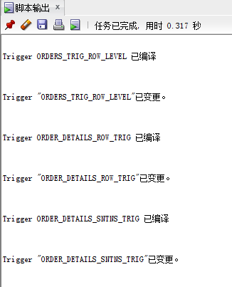

8.创建序列和视图VIEW_ORDER_DETAILS

```sql
CREATE SEQUENCE SEQ_ORDER_ID INCREMENT BY 1 START WITH 1 MAXVALUE 999999999 MINVALUE 1 CACHE 20 ORDER;
CREATE SEQUENCE SEQ_ORDER_DETAILS_ID INCREMENT BY 1 START WITH 1 MAXVALUE 999999999 MINVALUE 1 CACHE 20 ORDER;
CREATE OR REPLACE FORCE EDITIONABLE VIEW "VIEW_ORDER_DETAILS" ("ID", "ORDER_ID", "CUSTOMER_NAME", "CUSTOMER_TEL", "ORDER_DATE", "PRODUCT_TYPE", "PRODUCT_NAME", "PRODUCT_NUM", "PRODUCT_PRICE") AS
  SELECT
  d.ID,
  o.ORDER_ID,
  o.CUSTOMER_NAME,o.CUSTOMER_TEL,o.ORDER_DATE,
  p.PRODUCT_TYPE,
  d.PRODUCT_NAME,
  d.PRODUCT_NUM,
  d.PRODUCT_PRICE
FROM ORDERS o,ORDER_DETAILS d,PRODUCTS p where d.ORDER_ID=o.ORDER_ID and d.PRODUCT_NAME=p.PRODUCT_NAME;
```

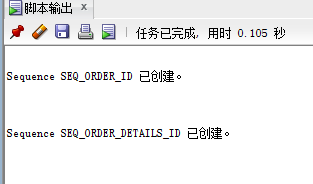
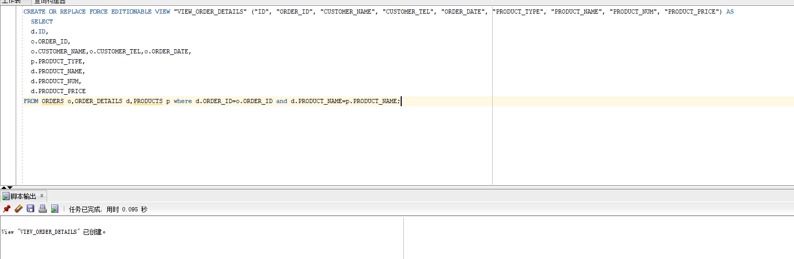

9.批量插入数据，注ORDERS.TRADE_RECEIVABLE（订单应收款）的自动计算,注意插入数据的速度并且完成对每一个分区不同数据的添加

```sql
declare
  dt date;
  m number(8,2);
  V_EMPLOYEE_ID NUMBER(6);
  v_order_id number(10);
  v_name varchar2(100);
  v_tel varchar2(100);
  v number(10,2);

begin
  for i in 1..10000
  loop
    if i mod 2 =0 then
      dt:=to_date('2015-3-2','yyyy-mm-dd')+(i mod 60);
    else
      dt:=to_date('2016-3-2','yyyy-mm-dd')+(i mod 60);
    end if;
    V_EMPLOYEE_ID:=CASE I MOD 6 WHEN 0 THEN 11 WHEN 1 THEN 111 WHEN 2 THEN 112 WHEN 3 THEN 12 WHEN 4 THEN 121 ELSE 122 END;
  ......
```

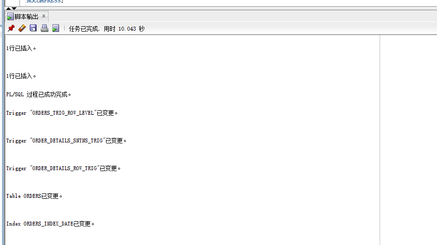

## 10.使用sql语句进行测试

1.查询某个员工的信息(吴经理)

```sql
select * from employees where name='吴经理'
```

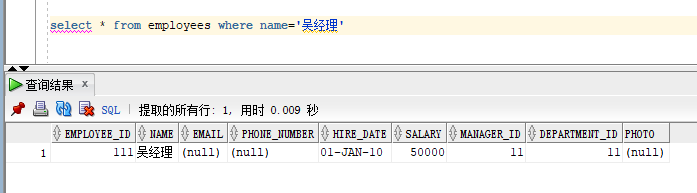

2.递归查询某个员工及其所有下属，子下属员工。

```sql
WITH A (EMPLOYEE_ID,NAME,EMAIL,PHONE_NUMBER,HIRE_DATE,SALARY,MANAGER_ID,DEPARTMENT_ID) AS
  (SELECT EMPLOYEE_ID,NAME,EMAIL,PHONE_NUMBER,HIRE_DATE,SALARY,MANAGER_ID,DEPARTMENT_ID
    FROM employees WHERE employee_ID = 11
    UNION ALL
  SELECT B.EMPLOYEE_ID,B.NAME,B.EMAIL,B.PHONE_NUMBER,B.HIRE_DATE,B.SALARY,B.MANAGER_ID,B.DEPARTMENT_ID
    FROM A, employees B WHERE A.EMPLOYEE_ID = B.MANAGER_ID)
SELECT * FROM A;
```

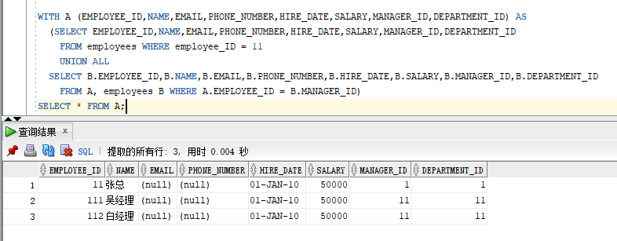

3.查询订单表，并且包括订单的订单应收货款: Trade_Receivable= sum(订单详单表.ProductNum*订单详单表.ProductPrice)- Discount。

```sql
select * from ORDERS
```
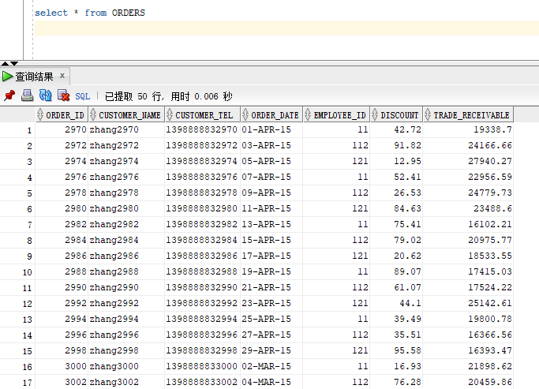

4.查询订单详表，要求显示订单的客户名称和客户电话，产品类型用汉字描述。

```sql
select o.customer_name,o.customer_tel, p.product_type AS 产品类型
FROM orders o,order_details d,products p
where o.order_id=d.order_id
and d.product_name=p.product_name
```

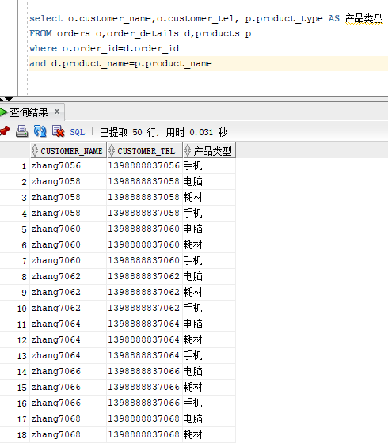

5.查询出所有空订单，即没有订单详单的订单。

```sql
select * from orders where order_id NOT in(SELECT o.order_id from orders o,order_details d WHERE o.order_id=d.order_id)
```

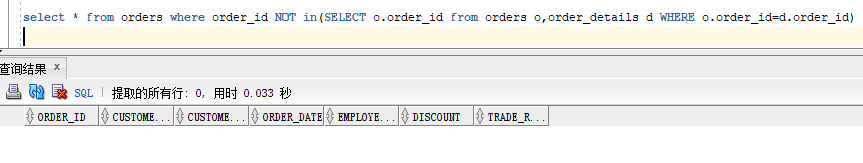

6.查询部门表，同时显示部门的负责人姓名。

```sql
select d.*,e.name
from departments d,employees e
where d.department_id=e.department_id
and e.manager_id=d.department_id
```

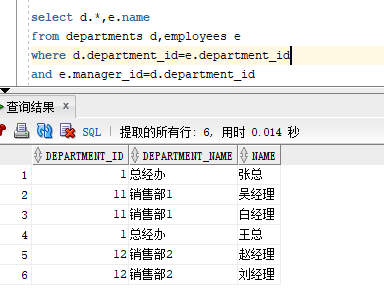

7.查询部门表，统计每个部门的销售总金额。

```sql
select d.department_name,SUM(sum1) FROM (select (d.product_num*d.product_price) sum1 from order_details d,orders o,departments d,employees e WHERE d.department_id=e.department_id and o.employee_id = e.employee_id and o.order_id=d.order_id),departments d group by d.department_name

```

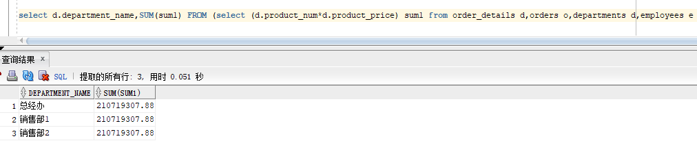