# 我的作业6

**姓名：杨永涛**
**学号:201810414127**

# 通信系统数据库设计

### 一.引言

  随着整个时代的信息化，产业的逐渐信息化已经成为了必不可少的潮流。同时，在各大中小型企业中，用计算机管理企业的信息已经变得十分的普遍。通过系统来完成通信的方式不仅可以提高工作效率，同时也能节省很多的人力物力。对于企业内部的资料也具有更高的安全性。通信系统的使用可以满足企业对大量信息的快速传递和处理的需求。本数据库是基于Oracle的通信系统数据，主要包括数据库表设计，用户管理设计，存储过程及函数设计以及备份方案的设计。

### 二. 实现步骤

#### 1.表空间设计

手工增加两个表空间USERS00和USERS01

```sql
Create Tablespace Users00
datafile
'/home/oracle/app/oracle/oradata/YYTDB/pdbtest_users00_1.dbf'
  SIZE 100M AUTOEXTEND ON NEXT 256M MAXSIZE UNLIMITED,
'/home/oracle/app/oracle/oradata/YYTDB/pdbtest_users00_2.dbf'
  SIZE 100M AUTOEXTEND ON NEXT 256M MAXSIZE UNLIMITED
EXTENT MANAGEMENT LOCAL SEGMENT SPACE MANAGEMENT AUTO;
Create Tablespace Users01
datafile
'/home/oracle/app/oracle/oradata/YYTDB/pdbtest_users01_1.dbf'
  SIZE 100M AUTOEXTEND ON NEXT 256M MAXSIZE UNLIMITED,
'/home/oracle/app/oracle/oradata/YYTDB/pdbtest_users01_2.dbf'
  SIZE 100M AUTOEXTEND ON NEXT 256M MAXSIZE UNLIMITED
EXTENT MANAGEMENT LOCAL SEGMENT SPACE MANAGEMENT AUTO; 

```

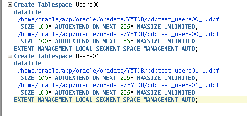

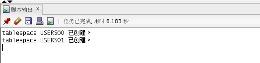

#### 2.权限及用户分配方案设计

2.1创建用户

创建用户YYT,YYT01并赋予用户表空间使用权限

```sql
CREATE USER YYT IDENTIFIED BY 123
DEFAULT TABLESPACE "USERS01"
TEMPORARY TABLESPACE "TEMP";
CREATE USER YYT01 IDENTIFIED BY 123
DEFAULT TABLESPACE "USERS00"
TEMPORARY TABLESPACE "TEMP";  
```

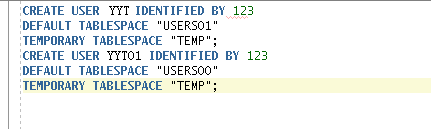

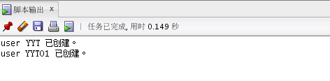

2.2创建角色

创建角色yyt_role,yyt_role01

```sql
CREATE ROLE yyt_role;
CREATE ROLE yyt_role01;
```

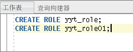

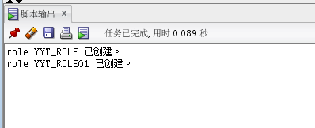

2.3分配权限

赋予用户分区表的权限

```sql
ALTER USER YYT QUOTA UNLIMITED ON USERS00;
ALTER USER YYT QUOTA UNLIMITED ON USERS01;
ALTER USER YYT ACCOUNT UNLOCK;
GRANT "CONNECT" TO YYT WITH ADMIN OPTION;
GRANT "RESOURCE" TO YYT WITH ADMIN OPTION;
ALTER USER YYT DEFAULT ROLE "CONNECT","RESOURCE";
```


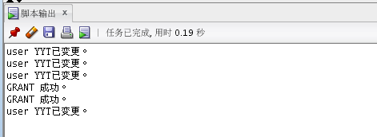

2.4分配空间

赋予角色权限和空间并把角色使用权限给用户

```sql
GRANT connect,resource,CREATE VIEW TO yyt_role;
ALTER USER YYT QUOTA 50M ON users01;
GRANT yyt_role TO yyt;
```

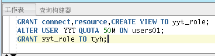

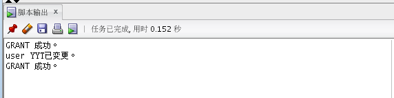

#### 3.表设计

3.1用户表设计

UUID为主键并根据注册日期进行分区，分为2020和2021两个分区并且每个分区按照4个季度进行划分

```sql
CREATE TABLE TABLE_USERS
(
"UUID" NUMBER(20,0) DEFAULT 1 NOT NULL ENABLE,
"ACCOUNT" NUMBER(20,0) NOT NULL ENABLE, 
​"PASSWORD" VARCHAR2(80 BYTE) NOT NULL ENABLE,
​"STATE" NUMBER(1,0) DEFAULT 0, 
​"NAME" VARCHAR2(40 BYTE), 
"REGISTRATIONDATE" DATE NOT NULL ,
 CONSTRAINT U_PK PRIMARY KEY 
  (
    UUID
  )
  USING INDEX 
  (
      CREATE UNIQUE INDEX U_PK ON TABLE_USERS(UUID ASC) 
      LOGGING 
      TABLESPACE USERS00
      PCTFREE 10 
      INITRANS 2 
      STORAGE 
      ( 
        BUFFER_POOL DEFAULT 
      ) 
      NOPARALLEL 
  )
  ENABLE 
) 
TABLESPACE USERS00
PCTFREE 10 
INITRANS 1 
STORAGE 
( 
  BUFFER_POOL DEFAULT 
) 
NOCOMPRESS 
NOPARALLEL 
PARTITION BY RANGE (REGISTRATIONDATE) 
SUBPARTITION BY RANGE (REGISTRATIONDATE) 
(
  PARTITION DATE2020 VALUES LESS THAN (TO_DATE(' 2020-12-31 00:00:00', 'SYYYY-MM-DD HH24:MI:SS', 'NLS_CALENDAR=GREGORIAN')) 
  TABLESPACE USERS00
  PCTFREE 10 
  INITRANS 1 
  STORAGE 
  ( 
    BUFFER_POOL DEFAULT 
  ) 
  NOCOMPRESS NO INMEMORY 
  (
    SUBPARTITION DATE2020_3 VALUES LESS THAN (TO_DATE(' 2020-03-31 00:00:00', 'SYYYY-MM-DD HH24:MI:SS', 'NLS_CALENDAR=GREGORIAN')) 
    NOCOMPRESS NO INMEMORY  
  , SUBPARTITION DATE2020_6 VALUES LESS THAN (TO_DATE(' 2020-06-30 00:00:00', 'SYYYY-MM-DD HH24:MI:SS', 'NLS_CALENDAR=GREGORIAN')) 
    NOCOMPRESS NO INMEMORY  
  , SUBPARTITION DATE2020_9 VALUES LESS THAN (TO_DATE(' 2020-09-30 00:00:00', 'SYYYY-MM-DD HH24:MI:SS', 'NLS_CALENDAR=GREGORIAN')) 
    NOCOMPRESS NO INMEMORY  
  , SUBPARTITION DATE2020_12 VALUES LESS THAN (TO_DATE(' 2020-12-31 00:00:00', 'SYYYY-MM-DD HH24:MI:SS', 'NLS_CALENDAR=GREGORIAN')) 
    NOCOMPRESS NO INMEMORY  
  )  
, PARTITION DATE2021 VALUES LESS THAN (TO_DATE(' 2021-12-31 00:00:00', 'SYYYY-MM-DD HH24:MI:SS', 'NLS_CALENDAR=GREGORIAN')) 
  TABLESPACE USERS01
  PCTFREE 10 
  INITRANS 1 
  STORAGE 
  ( 
    BUFFER_POOL DEFAULT 
  ) 
  NOCOMPRESS NO INMEMORY 
  (
    SUBPARTITION DATE2021_3 VALUES LESS THAN (TO_DATE(' 2021-03-31 00:00:00', 'SYYYY-MM-DD HH24:MI:SS', 'NLS_CALENDAR=GREGORIAN')) 
    NOCOMPRESS NO INMEMORY  
  , SUBPARTITION DATE2021_6 VALUES LESS THAN (TO_DATE(' 2021-06-30 00:00:00', 'SYYYY-MM-DD HH24:MI:SS', 'NLS_CALENDAR=GREGORIAN')) 
    NOCOMPRESS NO INMEMORY  
  , SUBPARTITION DATE2021_9 VALUES LESS THAN (TO_DATE(' 2021-09-30 00:00:00', 'SYYYY-MM-DD HH24:MI:SS', 'NLS_CALENDAR=GREGORIAN')) 
    NOCOMPRESS NO INMEMORY  
  , SUBPARTITION DATE2021_12 VALUES LESS THAN (TO_DATE(' 2021-12-31 00:00:00', 'SYYYY-MM-DD HH24:MI:SS', 'NLS_CALENDAR=GREGORIAN')) 
    NOCOMPRESS NO INMEMORY  
  )  
);
```


3.2 好友表设计

```sql
CREATE TABLE TABLE_FRIEND
(
  "ID" NUMBER(11,0) NOT NULL ENABLE,
  "MAINUUID" NUMBER(20,0) DEFAULT 1 NOT NULL ENABLE, 
  "FIRENDUUID" NUMBER(20,0) DEFAULT 1 NOT NULL ENABLE, 
  "FRIENDNAME" VARCHAR2(40 BYTE), 
  "FRIENDGROUP" VARCHAR2(40 BYTE), 
  CONSTRAINT ADMINISTRATOR_PK PRIMARY KEY 
  (
    ID 
  )
  USING INDEX 
  (
      CREATE UNIQUE INDEX TABLE_FRIEND_PK ON TABLE_FRIEND(ID ASC) 
      LOGGING 
      TABLESPACE USERS00
      PCTFREE 10 
      INITRANS 2 
      STORAGE 
      ( 
        BUFFER_POOL DEFAULT 
      ) 
      NOPARALLEL 
  )
  ENABLE 
) 
LOGGING 
TABLESPACE USERS00
PCTFREE 10 
INITRANS 1 
STORAGE 
( 
  BUFFER_POOL DEFAULT 
) 
NOCOMPRESS 
NO INMEMORY 
NOPARALLEL;
```

3.3 群组表设计

```sql
CREATE TABLE TABLE_GROUP
(
"UUID" NUMBER(20,0) NOT NULL ENABLE, 
​"ACCOUNT" NUMBER(20,0) NOT NULL ENABLE, 
"NAME" VARCHAR2(40 BYTE) NOT NULL ENABLE, 
"CREATOR" NUMBER(20,0) NOT NULL ENABLE, 
"CREATETIME" DATE, 
CONSTRAINT TABLE_GROUP_PK PRIMARY KEY 
  (
    UUID 
  )
  USING INDEX 
  (
      CREATE UNIQUE INDEX TABLE_GROUP_PK ON COMMODITY (UUID ASC) 
      LOGGING 
      TABLESPACE USERS01
      PCTFREE 10 
      INITRANS 2 
      STORAGE 
      ( 
        BUFFER_POOL DEFAULT 
      ) 
      NOPARALLEL 
  )
  ENABLE 
) 
LOGGING 
TABLESPACE USERS01
PCTFREE 10 
INITRANS 1 
STORAGE 
( 
  BUFFER_POOL DEFAULT 
) 
NOCOMPRESS 
NO INMEMORY 
NOPARALLEL;
```

3.4 管理员表设计

```sql
CREATE TABLE ADMINISTRATOR 
(
"ID" NUMBER(*, 0) NOT NULL, 
"PASSWORD" VARCHAR2(20 BYTE) NOT NULL, 
"ADMIN" VARCHAR2(20 BYTE) NOT NULL, 
CONSTRAINT ADMINISTRATOR_PK PRIMARY KEY 
  (
    ID 
  )
  USING INDEX 
  (
      CREATE UNIQUE INDEX ADMINISTRATOR_PK ON ADMINISTRATOR (ID ASC) 
      LOGGING 
      TABLESPACE USERS00 
      PCTFREE 10 
      INITRANS 2 
      STORAGE 
      ( 
        BUFFER_POOL DEFAULT 
      ) 
      NOPARALLEL 
  )
  ENABLE 
) 
LOGGING 
TABLESPACE USERS00 
PCTFREE 10 
INITRANS 1 
STORAGE 
( 
  BUFFER_POOL DEFAULT 
) 
NOCOMPRESS 
NO INMEMORY 
NOPARALLEL;
```

3.5聊天消息表设计

SENDERUUID为用户表的外键，聊天消息分区采用的是引用用户表分区

```sql
CREATE TABLE TABLE_CHATMSG
(
"MSGID" VARCHAR2(20 BYTE) NOT NULL ENABLE, 
"SENDERUUID" NUMBER(20,0) NOT NULL ENABLE, 
"TARGETUUID" NUMBER(20,0) NOT NULL ENABLE, 
"COLUMN1" VARCHAR2(1024 BYTE), 
"MSGTIME" DATE,
 CONSTRAINT TABLE_CHATMSG_PK PRIMARY KEY 
  (
    MSGID 
  )
  USING INDEX 
  (
      CREATE UNIQUE INDEX TABLE_CHATMSG_PK ON CARTMSG (MSGID ASC) 
      LOGGING 
      TABLESPACE USERS01
      PCTFREE 10 
      INITRANS 2 
      STORAGE 
      ( 
        BUFFER_POOL DEFAULT 
      ) 
      NOPARALLEL 
  )
  ENABLE 
, CONSTRAINT MSG_USERUUID FOREIGN KEY
  (
  SENDERUUID
  )
  ENABLE 
) 
PCTFREE 10 
PCTUSED 40 
INITRANS 1 
STORAGE 
( 
  BUFFER_POOL DEFAULT 
) 
NOCOMPRESS 
NOPARALLEL 
PARTITION BY REFERENCE (MSG_USERUUID ) 
(
  PARTITION DATE2020_3 
  LOGGING 
  TABLESPACE USERS00
  PCTFREE 10 
  INITRANS 1 
  STORAGE 
  ( 
    BUFFER_POOL DEFAULT 
  ) 
  NOCOMPRESS NO INMEMORY  
, PARTITION DATE2020_6 
  LOGGING 
  TABLESPACE USERS00
  PCTFREE 10 
  INITRANS 1 
  STORAGE 
  ( 
    BUFFER_POOL DEFAULT 
  ) 
  NOCOMPRESS NO INMEMORY  
, PARTITION DATE2020_9 
  LOGGING 
  TABLESPACE USERS00
  PCTFREE 10 
  INITRANS 1 
  STORAGE 
  ( 
    BUFFER_POOL DEFAULT 
  ) 
  NOCOMPRESS NO INMEMORY  
, PARTITION DATE2020_12 
  LOGGING 
  TABLESPACE USERS00
  PCTFREE 10 
  INITRANS 1 
  STORAGE 
  ( 
    BUFFER_POOL DEFAULT 
  ) 
  NOCOMPRESS NO INMEMORY  
, PARTITION DATE2021_3 
  LOGGING 
  TABLESPACE USERS01
  PCTFREE 10 
  INITRANS 1 
  STORAGE 
  ( 
    BUFFER_POOL DEFAULT 
  ) 
  NOCOMPRESS NO INMEMORY  
, PARTITION DATE2021_6 
  LOGGING 
  TABLESPACE USERS01
  PCTFREE 10 
  INITRANS 1 
  STORAGE 
  ( 
    BUFFER_POOL DEFAULT 
  ) 
  NOCOMPRESS NO INMEMORY  
, PARTITION DATE2021_9 
  LOGGING 
  TABLESPACE USERS01
  PCTFREE 10 
  INITRANS 1 
  STORAGE 
  ( 
    BUFFER_POOL DEFAULT 
  ) 
  NOCOMPRESS NO INMEMORY  
, PARTITION DATE2021_12 
  LOGGING 
  TABLESPACE USERS01
  PCTFREE 10 
  INITRANS 1 
  STORAGE 
  ( 
    BUFFER_POOL DEFAULT 
  ) 
  NOCOMPRESS NO INMEMORY  
);
```

3.6查看表空间

```sql
SELECT a.tablespace_name "表空间名",
total "表空间大小",
free "表空间剩余大小",
(total - free) "表空间使用大小",
total / (1024 * 1024 * 1024) "表空间大小(G)",
free / (1024 * 1024 * 1024) "表空间剩余大小(G)",
(total - free) / (1024 * 1024 * 1024) "表空间使用大小(G)",
round((total - free) / total, 4) * 100 "使用率 %"
FROM (SELECT tablespace_name, SUM(bytes) free
FROM dba_free_space
GROUP BY tablespace_name) a,
(SELECT tablespace_name, SUM(bytes) total
FROM dba_data_files
GROUP BY tablespace_name) b
WHERE a.tablespace_name = b.tablespace_name
```

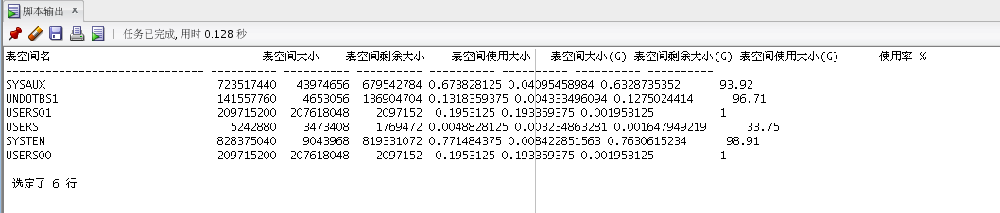

3.7插入用户表数据

```sql
declare
  uuid number(20,0);
  name varchar2(40);
  password varchar2(80);
  state number(1,0);
  account number(20,0)
  REGISTRATIONDATE date;
  MSG_ID varchar2(50);

begin
  for i in 1..20000
  loop
    if i mod 2 =0 then
      REGISTRATIONDATE:=to_date('2020-5-6','yyyy-mm-dd')+(i mod 60);
    else
      REGISTRATIONDATE:=to_date('2021-5-6','yyyy-mm-dd')+(i mod 60);
    end if;

    uuid:=SEQ_ORDER_ID.nextval;
    name := 'yang' || i;
    password := name || i || uuid;
    state :=(i mod 2);
    account:=(i mod 5);
    insert into TABLE_USERS 
    (uuid,account,password,state,name,REGISTRATIONDATE,msg_id)
    values 
    (uuid,account,password,state,name,REGISTRATIONDATE,msg_id);
end;
......
```

3.8插入关系

```sql
declare
mainuuid number(20,0);
firenduuid number(20,0);
indexid number(8,0);
begin
mainuuid:=10013;
firenduuid :=10013;
for i in 1.. 12
loop
    if i mod 2 = 0 then
        indexid :=2;
    else
        indexid := 1;
    end if;
    insert into table_friend(mainuuid,firenduuid) values(mainuuid,firenduuid+i);
    insert into table_friend(mainuuid,firenduuid) values(mainuuid+1,firenduuid+i);
    insert into table_friend(mainuuid,firenduuid) values(mainuuid+2,firenduuid+i);
    insert into table_friend(mainuuid,firenduuid) values(mainuuid+3,firenduuid+i);
    insert into table_friend(mainuuid,firenduuid) values(mainuuid+4,firenduuid+i);
    insert into table_friend(mainuuid,firenduuid) values(mainuuid+5,firenduuid+i);
    insert into table_friend(mainuuid,firenduuid) values(mainuuid+6,firenduuid+i);
    insert into table_friend(mainuuid,firenduuid) values(mainuuid+7,firenduuid+i);
    insert into table_friend(mainuuid,firenduuid) values(mainuuid+8,firenduuid+i);
    insert into table_friend(mainuuid,firenduuid) values(mainuuid+9,firenduuid+i);
    insert into table_friend(mainuuid,firenduuid) values(mainuuid+10,firenduuid+i);
    insert into table_friend(mainuuid,firenduuid) values(mainuuid+11,firenduuid+i);
    insert into table_friend(mainuuid,firenduuid) values(mainuuid+12,firenduuid+i);
end loop;
end;

3.9插入消息(5万)
declare
mainuuid number(20,0);
firenduuid number(20,0);
begin
mainuuid:=10013;
firenduuid :=10013;
for i in 1.. 5000
loop
    insert into table_chatmsg(SENDERUUID,TARGETUUID) values(mainuuid,firenduuid+2);
    insert into table_chatmsg(SENDERUUID,TARGETUUID) values(mainuuid+1,firenduuid+3);
    insert into table_chatmsg(SENDERUUID,TARGETUUID) values(mainuuid+2,firenduuid+4);
    insert into table_chatmsg(SENDERUUID,TARGETUUID) values(mainuuid+3,firenduuid+5);
    insert into table_chatmsg(SENDERUUID,TARGETUUID) values(mainuuid+4,firenduuid+6);
    insert into table_chatmsg(SENDERUUID,TARGETUUID) values(mainuuid+5,firenduuid+7);
    insert into table_chatmsg(SENDERUUID,TARGETUUID) values(mainuuid+6,firenduuid+8);
    insert into table_chatmsg(SENDERUUID,TARGETUUID) values(mainuuid+7,firenduuid+9);
    insert into table_chatmsg(SENDERUUID,TARGETUUID) values(mainuuid+8,firenduuid+10);
    insert into table_chatmsg(SENDERUUID,TARGETUUID) values(mainuuid+9,firenduuid+11);
    insert into table_chatmsg(SENDERUUID,TARGETUUID) values(mainuuid+10,firenduuid+1);
end loop;
end;
```

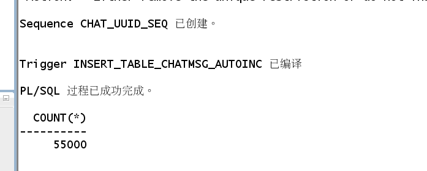

#### 4.存储过程和函数设计

4.1在数据库中建立一个程序包，在包中用PL/SQL语言设计一些存储过程和函数

创建一个包为TPack

函数Get_UserRegisTime为获取用户注册时间的函数

存储过程ADD_User是插入用户信息

```sql
create or replace PACKAGE TPack IS
  FUNCTION Get_UserRegisTime(V_UUID NUMBER) RETURN DATE;
  PROCEDURE ADD_User(account number,password varchar2,state number,name varchar2,REGISTRATIONDATE VARCHAR2);
END TPack;
```

4.2在包中创建一个函数，存储过程

```sql
create or replace PACKAGE BODY TPACK IS
FUNCTION Get_UserRegisTime(UUID NUMBER) RETURN DATE
AS
Res DATE; 
BEGIN
    select REGISTRATIONDATE into Res from table_users where V_UUID=UUID;
    RETURN Res;
END;
  procedure ADD_User(account number,password varchar2,state number,name varchar2,registerdate VARCHAR2) as
begin
  declare maxId number;
begin
  select max(id) into maxId from TABLE_USERS;
  insert into TABLE_USERS 
  values(maxId+1,account,password,state,name,to_date(registerdate,'yyyy-mm-dd'));
commit;
end;
end ADD_User;
END TPACK;

```

创建成功后包结构如下


使用自定义函数Get_UserRegisTime()查询uuid号为11111的注册时间

```sql
select TPACK.Get_UserRegisTime(11111) from dual;
```

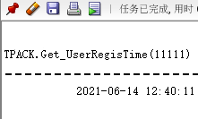

使用存储过程ADD_User插入数据

```sql
set serveroutput on
declare
begin
TPACK.ADD_User('666','123','1','wuhu','2021-06-01');
end;
```


4.3执行计划分析

```sql
select * from TABLE_USERS a,TABLE_CHATMSG b where a.uuid=b.SENDERUUID and
a.REGISTRATIONDATE between to_date('2020-1-1','yyyy-mm-dd') and to_date('2020-6-1','yyyy-mm-dd');
```

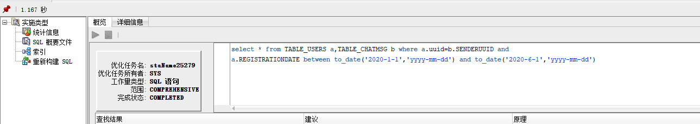


#### 5.备份方案设计

5.1全备份

```linux
[[oracle@oracle-pc ~]$ cat yyt_level0.sh
#yyt_level0.sh 
#!/bin/sh

export NLS_LANG='SIMPLIFIED CHINESE_CHINA.AL32UTF8'
export ORACLE_HOME=/home/oracle/app/oracle/product/12.1.0/dbhome_1  
export ORACLE_SID=orcl  
export PATH=$ORACLE_HOME/bin:$PATH  

yyt target / nocatalog msglog=/home/oracle/yyt_backup/lv0_`date +%Y%m%d-%H%M%S`_L0.log << EOF
run{
configure retention policy to redundancy 1;
configure controlfile autobackup on;
configure controlfile autobackup format for device type disk to '/home/oracle/yyt_backup/%F';
configure default device type to disk;
crosscheck backup;
crosscheck archivelog all;
allocate channel c1 device type disk;
backup as compressed backupset incremental level 0 database format '/home/oracle/yyt_backup/dblv0_%d_%T_%U.bak'
   plus archivelog format '/home/oracle/yyt_backup/arclv0_%d_%T_%U.bak';
report obsolete;
delete noprompt obsolete;
delete noprompt expired backup;
delete noprompt expired archivelog all;
release channel c1;
}
EOF

exit
[oracle@oracle-pc ~]$ ./yyt_level0.sh 
[oracle@oracle-pc ~]$ cd yyt_backup/
[oracle@oracle-pc yyt_backup]$ ls
arclv0_ORCL_20210525_90ugiejc_1_1.bak  dblv0_ORCL_20210511_8uugiegr_1_1.bak
arclv1_ORCL_20210525_92ugiel4_1_1.bak  dblv0_ORCL_20210525_8vugieii_1_1.bak
arclv1_ORCL_20210525_96ugielk_1_1.bak  dblv1_ORCL_20210525_93ugiel5_1_1.bak
c-1392946895-20210525-02               dblv1_ORCL_20210525_94ugield_1_1.bak
c-1392946895-20210525-00               lv0_20210525-003303_L0.log
c-1392946895-20210525-01               lv0_20210525-174530_L0.log
dblv0_ORCL_20210525_8tugiefo_1_1.bak   lv1_20210525-003650_L0.log
```

5.2备份后模拟数据库文件损坏、数据库完全恢复

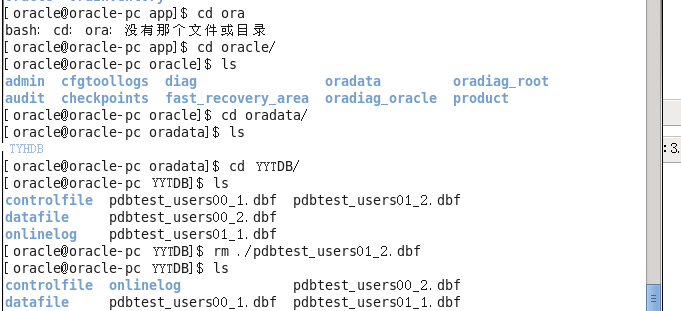

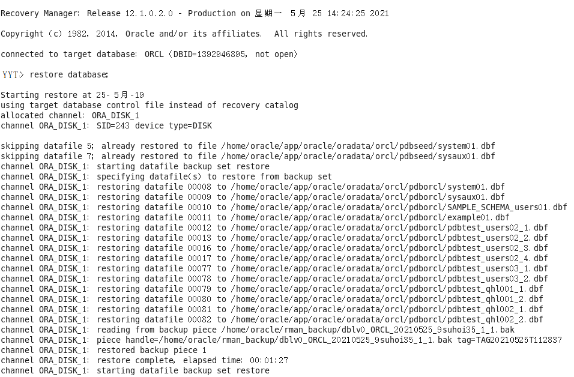

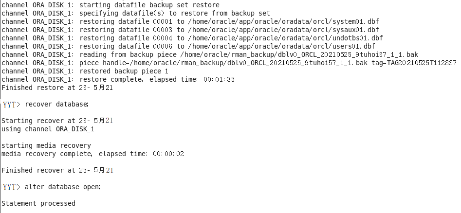